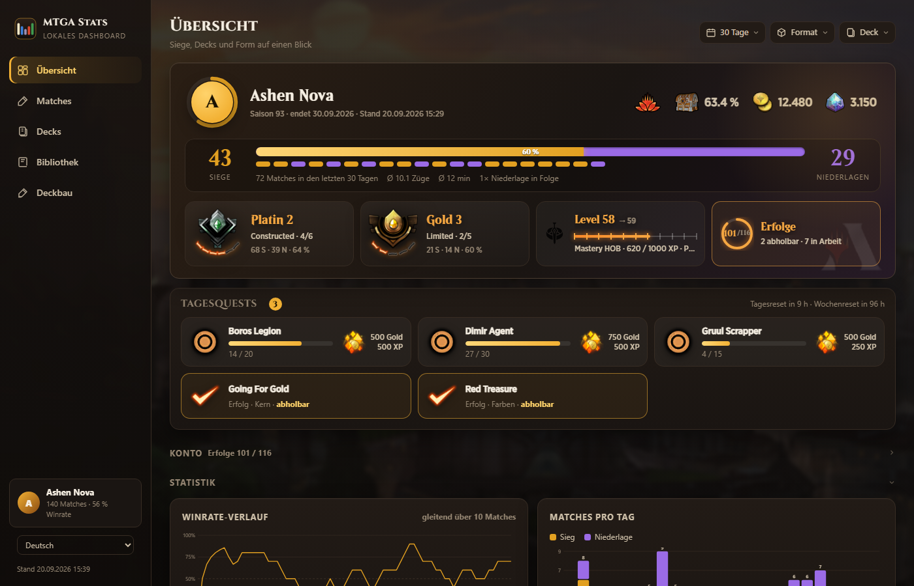
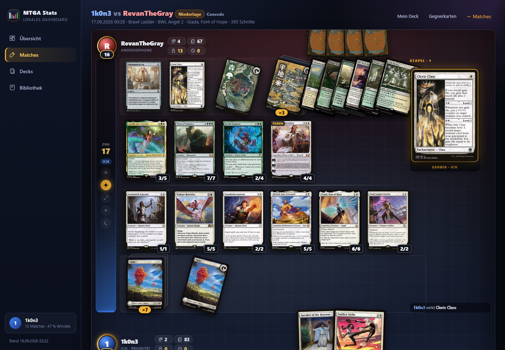
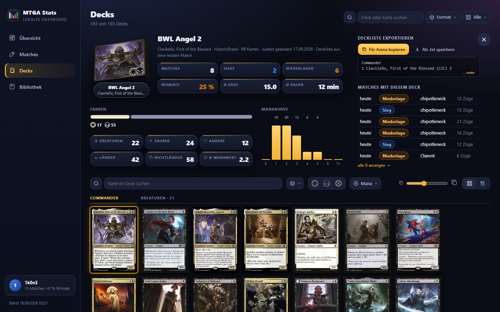
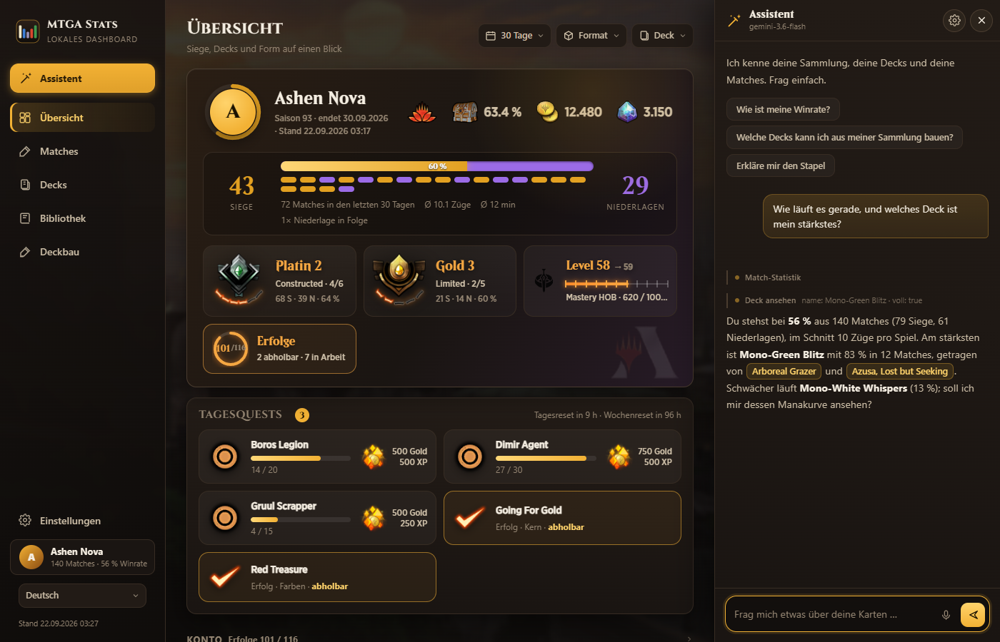

<p align="center">
  
</p>

<h1 align="center">MTGA Stats</h1>

<p align="center">
  Lokaler Begleiter für <strong>Magic: The Gathering Arena</strong> unter Windows, macOS und Linux (auch Steam Deck).<br>
  Sammlungs-Export, Match-Aufzeichnung mit Replays, Deck-Export, ein Dashboard im Stil des Spiels<br>
  und ein eingebauter KI-Assistent, der deine Sammlung, Decks und Matches kennt.<br>
  <strong>Deine Daten bleiben auf deinem PC. Kein Konto nötig; Website-Abgleich und KI-Assistent schaltest du selbst ein.</strong>
</p>

<p align="center">
  
</p>

> Ausführliche Dokumentation auf Englisch: [README.md](README.md)

## Installation mit einem Klick

1. **Herunterladen**: grüner Button **Code** → **Download ZIP**, dann irgendwo entpacken (zum Beispiel `C:\Spiele\mtga-stats`).
2. **Doppelklick auf `Install.cmd`.**
3. Fertig. Das Dashboard öffnet sich als eigenes Fenster, neben der Uhr erscheint ein Tray-Symbol, und ab jetzt werden deine Matches aufgezeichnet.

Der Installer prüft Node.js und installiert es bei Bedarf automatisch über den Windows-Paketmanager (`winget`). Er legt zwei Startmenü-Einträge an (**MTGA Stats** = Tray und Watcher, **MTGA Stats Dashboard** = das App-Fenster) und fragt einmal, ob alles beim Windows-Start mitlaufen soll. `Uninstall.cmd` entfernt alles wieder; deine Daten bleiben, wenn du es nicht anders willst.

Einmal in Arena einschalten: **Einstellungen → Konto → Detaillierte Protokolle (Plugin-Unterstützung)**. Ohne diese Option schreibt Arena keine Match-Daten.

## Was du bekommst

- **Übersicht**: Winrate, Verlauf, Matches pro Tag, Spiellänge, Spielbeginn, Winrate je Deck, Format und Gegner-Plattform.
- **Matches**: jedes Spiel mit Gegner, Deck, Ergebnis, Zügen, Dauer und den gesehenen Gegnerkarten.
- **Replays**: jedes Match Schritt für Schritt auf einem Spielfeld wie in Arena, mit Player-Leiste und Ereignisprotokoll.
- **Decks**: alle Arena-Decks als 3D-Deckboxen; Detailansicht mit Statistik, Manakurve, Farben, Kartenliste nach Typ, Suche, Filtern und Arena-Export.
- **Bibliothek**: alle Karten des Spiels mit Besitzstand, Suche, Filtern und Sortierung nach Siegen, Spielen oder Deck-Nutzung.
- **Kartendetails**: gedruckte Karte, Regeltext mit offiziellen Symbolen, Drucke und deine eigene Statistik zur Karte.
- **KI-Assistent**: kennt deine komplette Sammlung, deine Decks und deine Matches, beantwortet Fragen zu Magic und baut nach Rückfrage Decks um. Erster Eintrag der Seitenleiste auf jeder Seite, im Deckbau zusätzlich über der Deckliste, überall mit Strg+Y.
- **Sammlungs-Export** als CSV vor und nach jeder Sitzung mit fortlaufendem Änderungslog.

<p align="center">
  
  
</p>

## KI-Assistent

<p align="center">
  
</p>

Der Assistent arbeitet mit deinen echten Daten: Er durchsucht alle Arena-Karten samt Besitzstand, liest
deine Decks und Matches und fragt bei Bedarf Scryfall nach Regeln und Karten außerhalb von Arena. Karten
hebt er dort hervor, wo du sie gerade siehst, und heftet einen kurzen Kommentar daran. Decks ändert er erst,
nachdem du zugestimmt hast; jede Änderung lässt sich mit einem Klick zurücknehmen. Kartennamen in den
Antworten sind anklickbar und scrollen zur Karte. Jede Seite und jedes offene Deck bekommen ein eigenes
Gespräch, damit er nicht über ein Deck redet, das längst zu ist.

Er braucht ein Sprachmodell. Unter **Einstellungen → KI-Assistent** wählst du den Anbieter:

| Anbieter | Anmeldung | Kosten |
|---|---|---|
| **OpenRouter** (Vorauswahl) | Knopf „Mit OpenRouter verbinden“, Login im Browser | kostenlose Modelle mit Tageskontingent; die Liste zeigt nur solche mit Werkzeugunterstützung |
| **Google Gemini** | Schlüssel aus dem AI Studio einfügen | Gratistarif mit wenigen Anfragen pro Minute |
| **Groq** | Schlüssel einfügen | Gratiskontingent mit Tageslimit |
| **Anthropic, OpenAI** | Schlüssel einfügen | kostenpflichtig |
| **Ollama** | nichts | lokales Modell, kein Konto, braucht starke Hardware |
| **Eigener Anbieter** | Adresse und Schlüssel eintragen | jeder OpenAI-kompatible Dienst |

Jeder Anbieter behält seinen eigenen Schlüssel: Der Wechsel kostet einen Klick, und die Liste zeigt, wo schon
ein Zugang hinterlegt ist. Die Modelle stehen nach Gründlichkeit sortiert, die besten drei mit Stern. Bei
OpenRouter zeigen die Einstellungen außerdem, was vom Tageskontingent übrig ist, und führen zum Konto beim
Anbieter. Bilanz, Winrate je Deck und die letzten Matches stehen schon im Auftrag an das Modell, einfache
Fragen kosten deshalb nur eine Anfrage; braucht er Werkzeuge, denkt er danach erneut nach. Ist das
Minutenlimit eines Anbieters erreicht, zählt der Chat herunter und fragt selbst noch einmal, statt
abzubrechen. Schaltet ein Anbieter ein Modell ab, übernimmt der Chat den Nachfolger, den der Anbieter nennt.

Der Assistent gehört zu jeder Fassung. Eine Fassung ohne ihn baust du mit `"assistant": false` in
`watch-config.json` (oder einmalig mit `MTGA_ASSISTANT=0`): dann fehlen `assistant.js` und der Verweis
darauf in allen Seiten.

Die Schlüssel liegen auf deinem Rechner in `out/assistant.json` (nur für dich lesbar). Das Dashboard spricht
nie direkt mit dem Anbieter: alle Anfragen laufen über den lokalen Server, damit der Schlüssel nicht im Browser
landet, und der lokale Dienst nimmt sie nur von der eigenen Oberfläche an. Deine Fragen und die Daten, die der
Assistent dafür nachschlägt, gehen an den Anbieter, den du gewählt hast, sonst nirgendwohin. Hast du ein
Konto auf der Website verknüpft, wird der Zugang dorthin verschlüsselt gespiegelt, damit du auf beiden
Seiten ohne zweite Anmeldung verbunden bist. Ohne eingerichteten Anbieter bleibt der Assistent einfach aus.

## Woher die Daten kommen

- **Sammlung** aus dem Arbeitsspeicher des laufenden Clients (nur lesend; seit 2021 steht sie nicht mehr im Log).
- **Matches und Decks** aus der `Player.log`.
- **Kartennamen, Texte, Sets** aus der Kartendatenbank des Spiels.
- **Kartenbilder und Symbole** werden nur **verlinkt** (Scryfall), nie gespeichert. Fehlt eine Karte online, wird das Artwork aus den Spieldaten angezeigt, es ist also immer ein Bild da.

## Bedienung

- **Tray-Symbol**: Dashboard öffnen (auch per Linksklick), Status, Watcher starten/stoppen, Sammlung jetzt exportieren, Intervalle und Speicherort ändern, Protokoll öffnen.
- **App-Fenster**: Startmenü-Eintrag „MTGA Stats Dashboard“ oder `npm run app`.
- **Als App installieren**: `http://localhost:8765/` in Chrome oder Edge öffnen und „App installieren“ wählen.
- **Updates**: Dateien ersetzen (neues ZIP oder `git pull`). Hat der Tray den Watcher gestartet, startet dieser mit dem neuen Stand neu, sobald Arena nicht läuft; offene Seiten danach neu laden.

## macOS, Linux und Steam Deck

Seit 1.2.0 läuft der Companion auch auf macOS und Linux, inklusive Steam Deck (Arena über Steam/Proton):

```bash
chmod +x install.sh && ./install.sh
```

Der Installer lädt bei Bedarf ein portables Node.js nach `~/.mtga-stats` (ohne root), richtet den Watcher als Hintergrunddienst ein (launchd auf dem Mac, systemd-Benutzerdienst auf Linux/SteamOS), legt einen Eintrag **MTGA Stats** an, der das Dashboard öffnet, und startet alles. Steuerung: `scripts/unix/mtga-stats start|stop|status|dashboard|log`, entfernen mit `./install.sh --uninstall`.

Arena wird automatisch gefunden (Mac-App, Steam/Proton-Präfix `steamapps/compatdata/2141910`, Flatpak-Steam, Wine, Lutris, Bottles). Abweichende Orte gibst du mit `MTGA_DIR` (Ordner mit `MTGA_Data`) und `MTGA_LOG_DIR` (Ordner mit `Player.log`) an.

**Eine Einschränkung:** Die Kartensammlung (Besitzstand) liest das Tool aus dem Arbeitsspeicher des Spiels, das geht nur unter Windows. Auf Mac und Linux bekommst du Matches, Replays, Decks, Kontodaten und die komplette Kartenbibliothek, aber keine Besitzzahlen. Auf dem Steam Deck spielst du wie gewohnt im Gaming-Modus und öffnest das Dashboard im Desktop-Modus.

### Paketmanager

- **macOS (Homebrew):**
  ```bash
  brew tap mtga-stats/tap <Adresse vom grünen Code-Knopf>
  brew install mtga-stats && brew services start mtga-stats
  mtga-stats dashboard
  ```
- **Linux / Steam Deck (Flatpak):** im Desktop-Modus aus [`flatpak/`](flatpak/) bauen (ein Flathub-Eintrag ist geplant):
  ```bash
  flatpak install -y flathub org.flatpak.Builder org.freedesktop.Platform//24.08 org.freedesktop.Sdk//24.08
  flatpak run org.flatpak.Builder --user --install --force-clean build-dir flatpak/be.a16.mtga.Stats.yml
  flatpak run be.a16.mtga.Stats
  ```
  Das Flatpak bringt Node.js mit, legt Einstellungen unter `~/.var/app/be.a16.mtga.Stats` ab und findet Arena im Steam/Proton-Präfix (auch auf der SD-Karte).
- **Windows (winget):** geplant; bis dahin `Install.cmd`.

**Stand:** Windows ist die getestete Plattform. Mac und Linux sind neu in 1.2.0 und ohne Testgerät entstanden: Die Pfaderkennung ist per Test abgedeckt, die Skripte sind syntaxgeprüft, aber noch niemand hat es durchgängig ausprobiert. Wenn es bei dir läuft oder hakt, bitte ein Issue mit Plattform und der Ausgabe von `scripts/unix/mtga-stats status` anlegen.

## Voraussetzungen

Windows 10 oder 11 (voller Umfang) oder macOS / Linux / Steam Deck (alles außer der Sammlung), MTG Arena, Node.js 22.13 oder neuer (installieren `Install.cmd` bzw. `install.sh` bei Bedarf), in Arena die Option „Detaillierte Protokolle“.

## Wenn etwas nicht klappt

| Problem | Ursache und Lösung |
|---|---|
| Im Log steht `Zugriff auf MTGA verweigert (Win32 5)` | Arena läuft als Administrator. Arena normal starten oder den Autostart erhöht einrichten: `npm run autostart -- -Elevated`. |
| Keine Matches | In Arena „Detaillierte Protokolle“ einschalten und ein Match spielen. |
| Karten zeigen kurz nur das Artwork | Scryfall drosselt kurz die Bildabfragen, die Seite versucht es von selbst erneut. |
| `EADDRINUSE` beim Start | Es läuft schon eine Instanz. Über das Tray stoppen oder `webPort` ändern. |

## Lizenz

MIT, siehe [LICENSE](LICENSE). MTGA Stats ist inoffizieller Fan-Inhalt gemäß der Fan Content Policy von Wizards of the Coast und wird von Wizards weder unterstützt noch genehmigt. Kartenbilder und Symbole stammen von [Scryfall](https://scryfall.com) und werden verlinkt, nicht weiterverbreitet.
