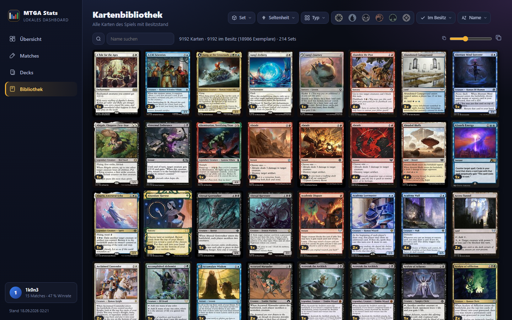
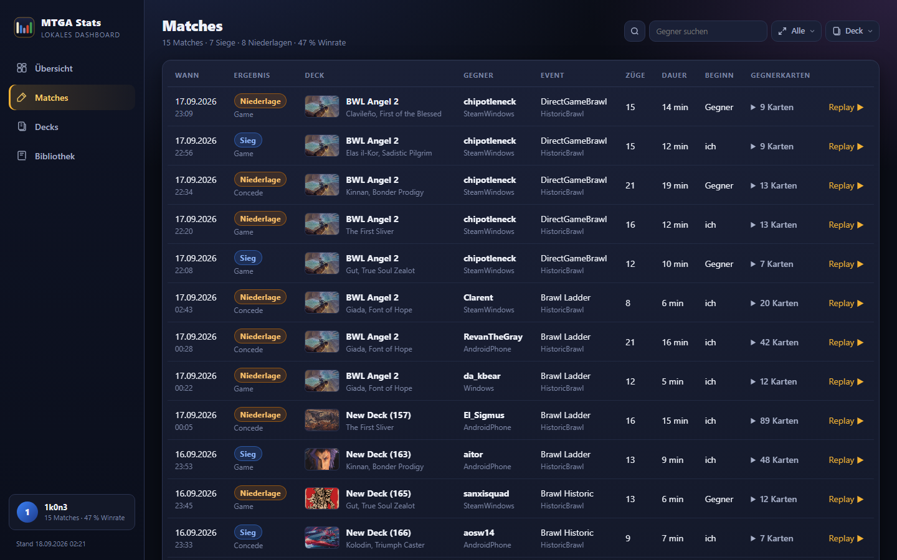

<p align="center">
  
</p>

<h1 align="center">MTGA Stats</h1>

<p align="center">
  A local companion for <strong>Magic: The Gathering Arena</strong> on Windows, macOS and Linux (incl. Steam Deck).<br>
  Collection export, match recording with board replays, deck export, a game-styled dashboard<br>
  and a built-in AI assistant that knows your collection, decks and matches.<br>
  <strong>Your data stays on your PC. No account needed; website sync and the AI assistant are opt-in.</strong>
</p>

<p align="center">
  <a href="#one-click-install"></a>
  <a href="#macos-linux-and-steam-deck"></a>
  <a href="#macos-linux-and-steam-deck"></a>
  <a href="https://nodejs.org"></a>
  <a href="LICENSE"></a>
  
  
  <a href="#ai-assistant"></a>
</p>

<p align="center">
  
</p>

> Deutsche Kurzanleitung: [README.de.md](README.de.md)

---

## One-click install

1. **Download** the project: green **Code** button → **Download ZIP**, then unzip it anywhere (for example `C:\Games\mtga-stats`).
2. **Double-click `Install.cmd`.**
3. Done. The dashboard opens as its own window, a tray icon appears next to the clock, and the watcher records your matches from now on.

The installer checks for Node.js and installs it automatically through the Windows Package Manager (`winget`) if it is missing. It creates two Start Menu entries (**MTGA Stats** = tray + watcher, **MTGA Stats Dashboard** = the app window) and asks once whether it should start with Windows. `Uninstall.cmd` removes everything again; your data folder stays unless you ask for it to be deleted.

One thing to enable in Arena once: **Settings → Account → Detailed Logs (Plugin Support)**. Without it Arena writes no match data.

<details>
<summary>Command line instead</summary>

```bash
git clone <URL from the green Code button> mtga-stats
cd mtga-stats
npm run tray        # tray icon, watcher and dashboard server
npm run app         # dashboard as its own window
npm run shortcut    # Start Menu entries
npm run autostart   # run at login
```
</details>

## What you get

| | |
|---|---|
| **Dashboard** – win-rate ring, rolling trend, matches per day, game length, play/draw split, win rate per deck, format and opponent platform, all with hover details. | **Matches** – every game with opponent, deck, result, turns, duration and the cards the opponent revealed (exportable as text). |
| **Replays** – step through any match on a board that mirrors Arena: hands, lands, permanents, stack, graveyards, life totals, phases, with a video-style player bar and an event log. | **Decks** – all your Arena decks as 3D deck boxes; open one for stats, mana curve, colour split, card list by type, search, filters and one-click Arena export. |
| **Card library** – every card in the game with owned counts, search, set, rarity, type, colour and ownership filters, sorting by wins, plays or deck usage. | **Card details** – printed card, rules text with official symbols, printings, and your own statistics: decks it sits in, matches you played it in, win rate with it, how often opponents showed it. |

<p align="center">
  
  
</p>
<p align="center">
  
  
</p>

### AI assistant

<p align="center">
  
</p>

The assistant works with your real data. It searches every Arena card with your owned counts, reads your decks
and match statistics, asks Scryfall about rules and cards outside Arena, marks cards in the list or grid with a
short note, and changes the deck in the builder after asking you first (every change has an undo). Your record,
win rate per deck and recent matches are already part of its briefing, so simple questions cost a single request.
It is the first entry in the sidebar on every page, plus a button above the deck list in the builder, and Ctrl+Y
opens it anywhere. Card names in its answers are clickable and scroll to the card where you can see it. Each page
and each open deck starts its own conversation, so it never argues about a deck you closed minutes ago.

Pick a provider under Settings → AI assistant:

| Provider | Sign-in | Cost |
|---|---|---|
| **OpenRouter** (preselected) | "Connect" button, login in the browser | free models with a daily quota; paid models with credit |
| **Google Gemini** | paste a key from Google AI Studio | free tier with a few requests per minute |
| **Groq** | paste a key | free tier with a daily limit |
| **Anthropic, OpenAI** | paste a key | paid |
| **Ollama** | nothing | local model, no account, needs strong hardware |
| **Custom** | address and key | any OpenAI-compatible service |

Each provider keeps its own key, so switching back and forth costs one click and the settings show which ones
are already connected. The model list is sorted by depth with the best three starred, and for OpenRouter the
settings show what is left of today's free quota. When a provider's per-minute limit is hit, the chat counts
down and asks again by itself instead of failing; when a provider retires a model, it switches to the successor
the provider names.

Keys live on your machine in `out/assistant.json`, readable only by you; all requests go through the local
server so the key never reaches the browser, and the local API only accepts calls from the dashboard itself.
Your questions and the data the assistant looks up go to the provider you picked, nowhere else. If you have
linked a website account, the access is mirrored there encrypted so you are connected on both sides without a
second login.

The assistant ships with every build. To build a version without it, set `assistant: false` in
`watch-config.json` (or `MTGA_ASSISTANT=0` for a single build): `assistant.js` and its `<script>` tag are then
left out of every page.

Also: collection export as CSV before and after every session with a running change log, live refresh of open pages when new data arrives, and an installable web app (Chrome/Edge offer "Install app").

## macOS, Linux and Steam Deck

Since 1.2.0 the companion also runs on macOS and Linux, including the Steam Deck (Arena via Steam/Proton).

```bash
chmod +x install.sh && ./install.sh
```

The installer downloads a portable Node.js into `~/.mtga-stats` if none is found (no root needed), sets up the watcher as a background service (launchd on macOS, a systemd user service on Linux/SteamOS), adds an **MTGA Stats** app entry that opens the dashboard, and starts everything. Control it with `scripts/unix/mtga-stats start|stop|status|dashboard|log`; remove it with `./install.sh --uninstall`.

Arena is found automatically: the Mac app bundle, the Steam/Proton prefix (`steamapps/compatdata/2141910`), Flatpak Steam, Wine, Lutris and Bottles prefixes. If your setup differs, point the tool at it with `MTGA_DIR` (folder containing `MTGA_Data`) and `MTGA_LOG_DIR` (folder containing `Player.log`).

**One limitation:** the card collection (owned counts) is read from the game's memory, which only works on Windows. On macOS and Linux you get matches, replays, decks, account data and the full card library, but no ownership numbers. On the Steam Deck, play in Game Mode as usual and open the dashboard from Desktop Mode.

### Package managers

- **macOS (Homebrew):**
  ```bash
  brew tap mtga-stats/tap <URL from the green Code button>
  brew install mtga-stats && brew services start mtga-stats
  mtga-stats dashboard
  ```
- **Linux / Steam Deck (Flatpak):** build the bundle from [`flatpak/`](flatpak/) in Desktop Mode (a Flathub listing is planned):
  ```bash
  flatpak install -y flathub org.flatpak.Builder org.freedesktop.Platform//24.08 org.freedesktop.Sdk//24.08
  flatpak run org.flatpak.Builder --user --install --force-clean build-dir flatpak/be.a16.mtga.Stats.yml
  flatpak run be.a16.mtga.Stats
  ```
  The Flatpak bundles Node.js, keeps settings in `~/.var/app/be.a16.mtga.Stats` and reads Arena from the Steam/Proton prefix (also on an SD card).
- **Windows (winget):** planned; use `Install.cmd` for now.

**Status:** Windows is the tested platform. macOS and Linux support is new in 1.2.0 and was built without a test machine: the path detection is unit-tested, the scripts are syntax-checked, but nobody has run it end to end yet. If it works or breaks for you, please open an issue with your platform and the output of `scripts/unix/mtga-stats status`.

## Requirements

- Windows 10 or 11 (full features), or macOS / Linux / Steam Deck (everything except the collection), and MTG Arena.
- Node.js 22.13 or newer (installed automatically by `Install.cmd` or `install.sh` if missing).
- Arena option **Detailed Logs (Plugin Support)** enabled.
- Chrome or Edge for the app window (any browser works for the normal page).

## Everyday use

- **Tray icon**: open the dashboard (also with a left click), see the status, start or stop the watcher, export the collection now, change intervals and the output folder, open the log.
- **App window**: `MTGA Stats Dashboard` in the Start Menu, or `npm run app`. Runs Chrome/Edge in app mode with its own profile, so it behaves like a program with its own taskbar entry.
- **Install as app**: open `http://localhost:8765/` in Chrome or Edge and choose "Install app" from the address bar for a native-looking entry in the Start Menu.
- **Updates**: replace the files (new ZIP or `git pull`). When the tray started the watcher, it restarts itself with the new code as soon as Arena is not running; reload open pages afterwards.

## Configuration

All settings live in [`watch-config.json`](watch-config.json) and can also be changed from the tray menu.

| Key | Default | Meaning |
|---|---|---|
| `pollSec` | 300 | How often to check whether Arena is running |
| `checkSec` | 60 | How often to look for collection changes while Arena runs |
| `fullScanSec` | 600 | Interval for a complete memory scan |
| `matchCheckSec` | 10 | How often the log is read for match events |
| `webPort` | 8765 | Port of the dashboard server |
| `outDir` | `out` | Where CSVs, matches and the dashboard are written |
| `prefetchCardImages` | false | Resolve image links for all known cards at start (off: resolved on demand) |
| `assistant` | true | Ship the AI assistant with the interface. `false` builds a version without it: `assistant.js` and its `<script>` tag are left out of every page (`MTGA_ASSISTANT=0` does the same for one build) |

## Output files (`out\`)

Collection CSV before and after each session, `changes.csv` (running change log), `sessions.csv`, deck exports (`decks\`), one JSON per match with replay data (`matches\`), the built dashboard (`web\`) and `watch.log`. CSVs use semicolons and a BOM so Excel opens them directly.

## Troubleshooting

| Symptom | Cause and fix |
|---|---|
| Log says `Zugriff auf MTGA verweigert (Win32 5)` | Arena runs as administrator. Either start Arena normally or register the autostart task elevated: `npm run autostart -- -Elevated`. |
| No matches appear | Enable **Detailed Logs** in Arena (Settings → Account) and play a match. |
| Cards show artwork instead of the printed card for a minute | Scryfall rate-limits image lookups briefly; the page retries by itself. |
| `EADDRINUSE` on start | Another instance already runs on the port. Stop it via the tray or change `webPort`. |
| Page is empty in the browser | The dashboard needs the running server (tray icon). Opening `out\web\index.html` directly only works partially. |

## Development

```bash
npm test          # unit tests (node --test)
npm run build     # rebuild the dashboard from out\
npm run serve     # dashboard server only
npm run export    # one-shot collection export
npm run decks     # one-shot deck export
npm run matches   # parse matches from the log
```

```
src/        watcher, memory scan glue, log parsers, dashboard generator, HTTP server, Unity texture reader
web/        dashboard (index, matches, decks, library, replay) – static HTML/CSS/JS, no build step
scripts/    PowerShell: tray icon, installer, autostart task, shortcuts, memory scanner, icon generator
tests/      node --test suites
assets/     icons
```

Contributions are welcome, see [CONTRIBUTING.md](CONTRIBUTING.md). Bug reports: please attach the last lines of `out\watch.log`.

## License and disclaimer

MIT, see [LICENSE](LICENSE).

MTGA Stats is unofficial Fan Content permitted under the Wizards of the Coast Fan Content Policy. Not approved or endorsed by Wizards. Portions of the materials used are property of Wizards of the Coast. © Wizards of the Coast LLC. Card images and symbols are provided by [Scryfall](https://scryfall.com) and are linked, not redistributed.
